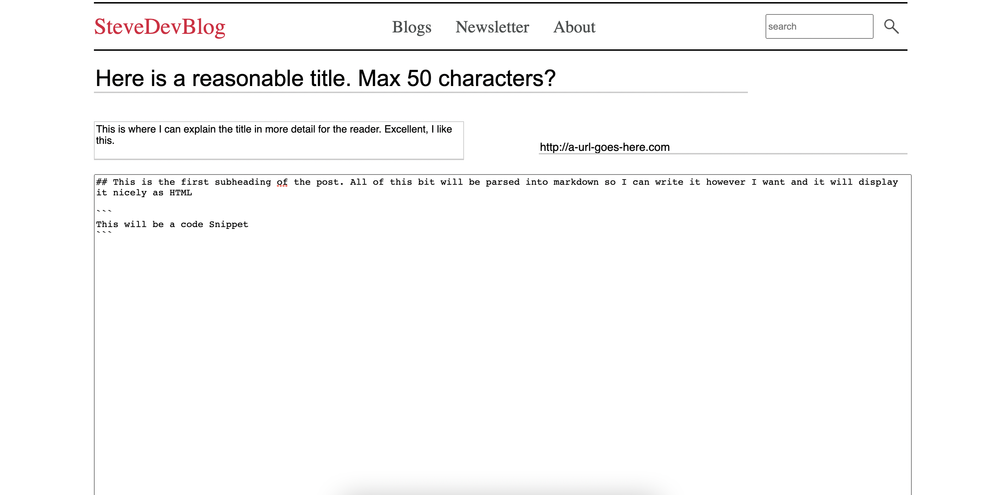

# Dev Blog v2

## Access the live site at this address:
[stevedevblog](https://stevedevblog.com)

## First draft of the Homepage


## First draft of the New Post Page



## ToDo list:
1. Document how I set up Docker, EC2, Nginx, Domain and LetsEncrypt
2. Iterate on process for deploying updates to Prod
3. Add testing to everything
4. Finalise CSS for homepage
5. Add admin page for managing posts (Eg add new, edit, delete)
6. Add post category as a collection in db to persist and add more in admin
7. Add image upload functionality with cropping/compression to standardise header images
8. Add intro text on homepage
9. Implement Newsletter sign up for new post alerts
10. Add the about page


## Commands I should save (local):

- ssh into EC2 host (after saving certificate)
```
ssh ec2-user@stevedevblog.com
```

- run local docker image
```
docker run --name steve-dev-blog -d -p 8080:8080 blog-site-test-v1:latest
```
- package JAR for deployment
```
mvn clean package
```
- Build Docker image for amd64 (By default my mac will build for arm M1 EC2 is amd64) then push to my Docker deployment repo
```
docker buildx build --platform linux/amd64 --push -t steve763/deployment .
```


# Commands I should save (EC2):

- Pull docker image down
```
docker login
docker pull steve763/test-repo
```

- Start image up in a container
```
docker run -p8080:8080 steve763/test-repo:latest
docker run -p8080:8080 -d --name steve-dev-blog steve763/test-repo:latest
```

- Stop without removing
```
docker stop steve-dev-blog
```

- Start back up
```
docker start steve-dev-blog
```

- Clear old containers
```
docker container prune
```


